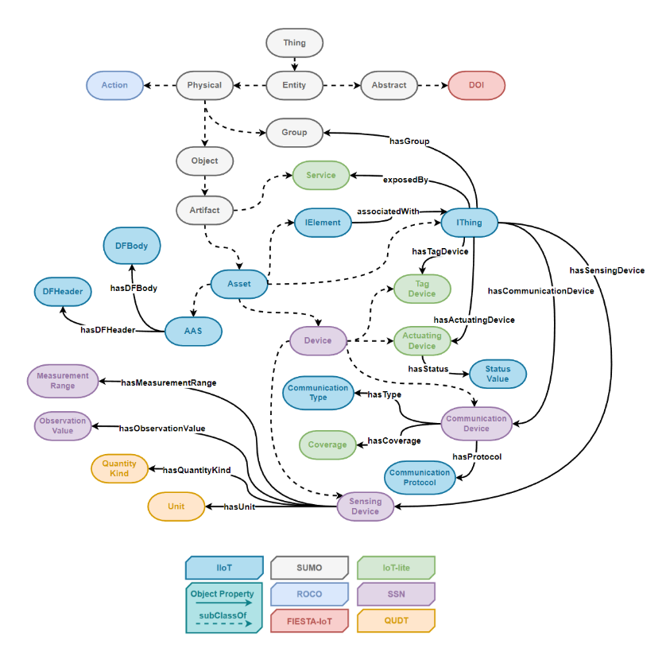

This repository contains the IIoT Ontology (IIoTOnto) Protégé files and Taxonomy.

### IIoTOnto

The IIoTOnto was created to address semantic and syntactic interoperability challenges within Industrial Internet of Things (IIoT) applications. It achieves this by combining several well-established ontologies from the literature, such as SSN (https://www.w3.org/TR/vocab-ssn/), IoT-Lite (https://www.w3.org/Submission/iot-lite/), QUDT (https://qudt.org/), alongside 1872-2015 - IEEE Standard Ontologies for Robotics and Automation (https://ieeexplore.ieee.org/document/7084073), to craft a specialized one for IIoT applications. Furthermore, the proposed ontology includes crucial concepts relevant to industrial applications previously absent in the based ontologies. 

The figure above showcases a portion of the IIoTOnto, comprising more than 450 classes and 40 properties, that have been expanded with the ontologies above and newly introduced classes related to IIoT applications.

### Authors
This work is (c) by the following authors:
- Pedro H. Morgan Pereira, ISI SIM
- Edison Pignaton de Freita, UFRGS
- Carlos Eduardo Pereira, UFRGS

### Reference
- "IEEE Standard Ontologies for Robotics and Automation," in IEEE Std 1872-2015, vol., no., pp.1-60, 10 April 2015, doi: 10.1109/IEEESTD.2015.7084073.
- Bermudez-Edo, M., Elsaleh, T., Barnaghi, P., & Taylor, K. (2016, July). IoT-Lite: a lightweight semantic model for the Internet of Things. In 2016 INTL IEEE conferences on ubiquitous intelligence & computing, advanced and trusted computing, scalable computing and communications, cloud and big data computing, internet of people, and smart world congress (uic/atc/scalcom/cbdcom/iop/smartworld) (pp. 90-97). IEEE.
- Rijgersberg, H., Van Assem, M., & Top, J. (2013). Ontology of units of measure and related concepts. Semantic Web, 4(1), 3-13.
- Compton, M., Barnaghi, P., Bermudez, L., Garcia-Castro, R., Corcho, O., Cox, S., ... & Taylor, K. (2012). The SSN ontology of the W3C semantic sensor network incubator group. Journal of Web Semantics, 17, 25-32.

## License

This work is licensed under a [Creative Commons Attribution 4.0 International (CC-BY-4.0)](https://creativecommons.org/licenses/by/4.0/legalcode) license.

